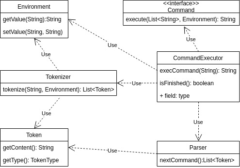

# Software_Engineering Task 1
## Diagram

`Tokenize` - разбивает строку на токены, с информацией о присваивании или о возможной необходимости подставить в токен переменную.

`Parser` - выдает токены следующей команды.

`CommandExecutor` - Выполняет команду. Вернет `isFinished() = true` если была команда `exit`.

`Main` - читает и выполняет команды пока может `CommandExecutor`.

`Comand` - интерфейс команды. Для добавления новой достаточно реализовать этот интерфейс и добавить команду в словарь `CommandExecutor`.

## Argument parsing library

Кроме использованого Jcommander рассматривались так же Apache common CLI и JSAP. Выбрал Jcommander из-за простого интерфейса и легко находимой документации с примерами использования.